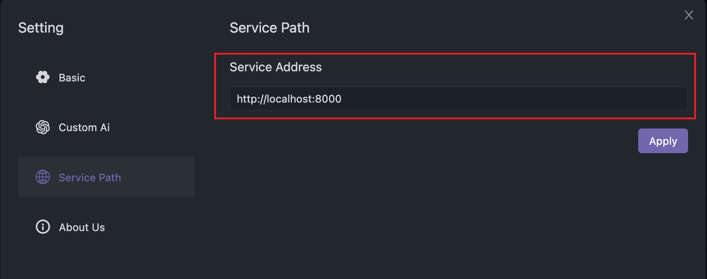

- During our research, we found that some students prefer a good client software experience, while others prefer using the web version without the need to install additional software. So, from the very beginning of our design, we considered supporting both the client and web versions. In the end, we support Mac, Linux, Windows clients, and a web version.

**Let's first take a look at the technical solutions of Navicat, DBever, and DataGrip, as well as their advantages and disadvantages.**

| Solution | Advantages | Disadvantages |
| --- | --- | --- |
| **Navicat (C++)** | Good workflow, feature-rich | Doesn't support web version, high development cost |
| **DBever (Java swing + JS)** | Cross-platform, supports web version | High development cost for the web version |
| **DataGrip (Java swing)** | Good user experience, visually appealing | Doesn't support web version |

Is there a **perfect solution** that can support both the web version and cross-platform, with a common frontend solution? The answer is Electron. The most successful case is VSCode, which offers a great user experience and can be deployed on multiple platforms, including a straightforward web deployment.

Now, how about the server-side?

**To achieve multi-platform support, we made some technology comparisons.**

| Solution | Advantages | Disadvantages |
| --- | --- | --- |
| **Electron + Node.js** | Pure JS frontend development, decent user experience | JS may not be perfect for various database support, frontend developers often lack knowledge of database-specific features |
| **Java swing + JS** | Cross-platform support, Java handles databases well, supports web | Swing is challenging to use, limited Java usage among frontend developers, dual frontend development |
| **Electron + JS + Java** | Supports multi-platform display, also supports web, separation of frontend and backend | Slower server startup |

In the end, we chose the **Electron + JS + Java solution**, and we believe we are among the first to use this approach to support both the client and web versions. This solution offers excellent code reuse, efficiency, and language advantages. The only drawback is that Java's Spring startup is slightly slower, but we've optimized it, and it can now start up in about 5 seconds, similar to most software. Additionally, in the future, we can provide users with the option to keep the Java process running when they close the client, allowing for near-instant startup on the next launch, so this disadvantage doesn't significantly affect us.

| Platform | Support |
| ------- | ------- |
| Mac     | ✅ Supported |
| Windows | ✅ Supported |
| Linux   | ✅ Supported |
| Web     | ✅ Supported |

| Platform  | Mac     | Windows | Linux   | Web     |
| --------- | ------- | ------- | ------- | ------- |
| Support  | ✅ Supported  | ✅ Supported  | ✅ Supported  | ✅ Supported  |

## Client Connecting to Shared Services
By default, the client connects locally. If your team has shared services, you can configure the IP and port for the shared service.

