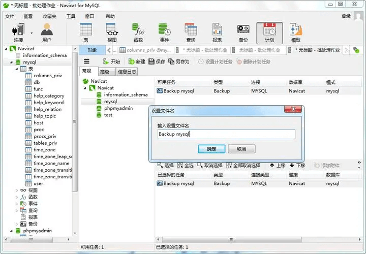
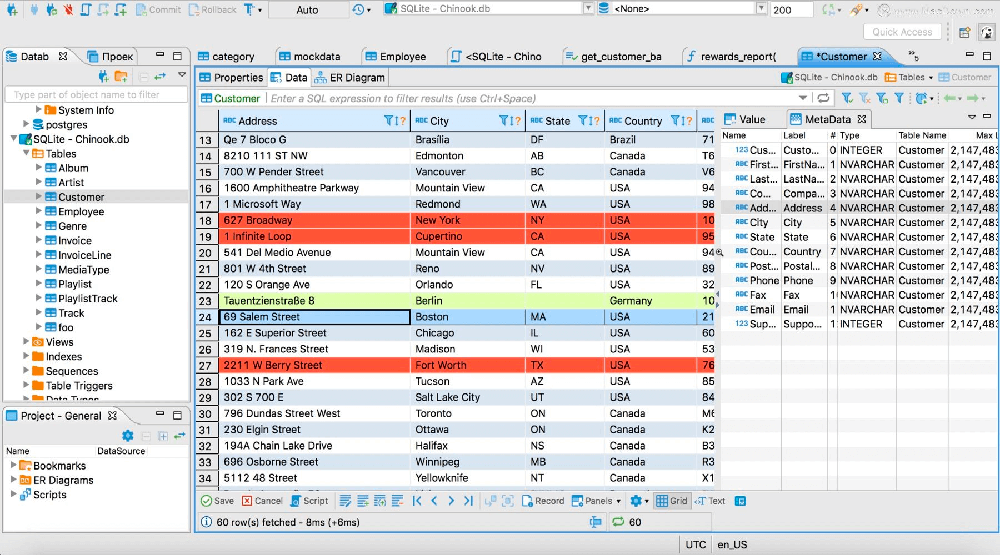
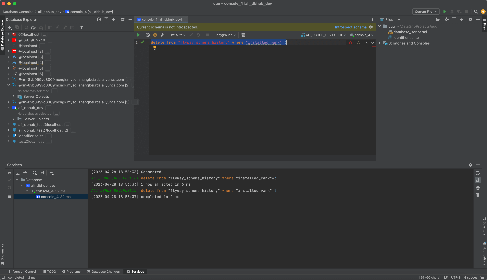
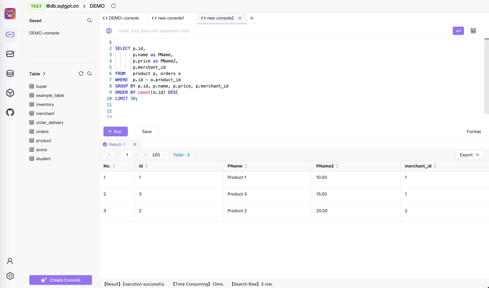
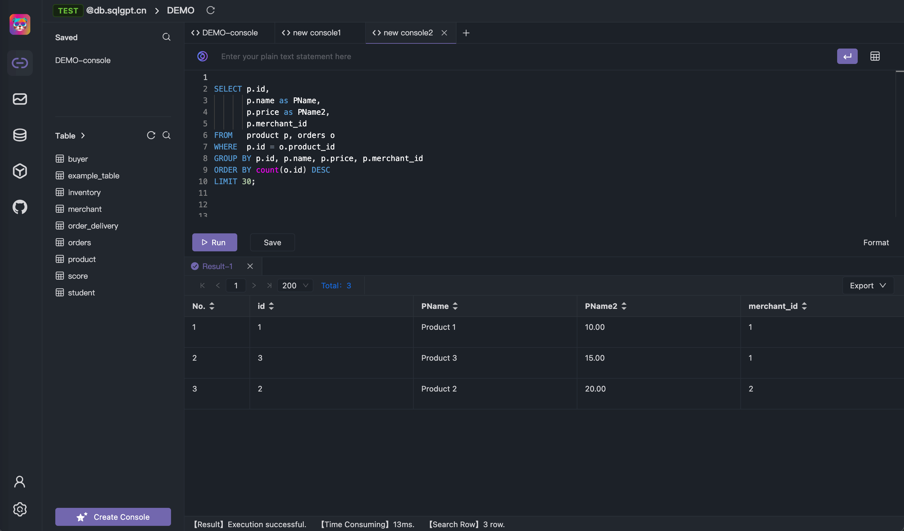

The overall visual experience draws inspiration from Navicat, DBever, and DataGrip. We adhere to the principle of simplicity and user-friendliness, as a clean visual design enhances the efficiency of technical professionals. After comprehensive comparison with these software options, we ultimately found that DataGrip provides the best user experience. Consequently, we incorporated some of DataGrip's design elements into our own.

## Navicat

## DBever

## DataGrip

## Chat2DB
Through a comparison with several commonly used database software, it became evident that DataGrip offers a superior visual experience. Therefore, in terms of visual design and user experience, we have drawn inspiration from DataGrip.

We might appear somewhat similar to DataGrip as we also support a dark mode. In addition to background color, in the future, we will also provide the option to customize the primary theme color, allowing users to choose their preferred color scheme.

