# User Guide

## 10-minute Quick Start Video

<iframe width="560" height="315" src="https://www.youtube.com/embed/bCsp-tf-VOE?si=JUivpzxicHx3QPzF" title="YouTube video player" frameborder="0" allow="accelerometer; autoplay; clipboard-write; encrypted-media; gyroscope; picture-in-picture; web-share" allowfullscreen></iframe>

## Access the DEMO Database

Open Chat2DB client, click the "Connections" button on the left, select "DEMO Database", right-click the "Connect" button or double-click to connect to the DEMO database.

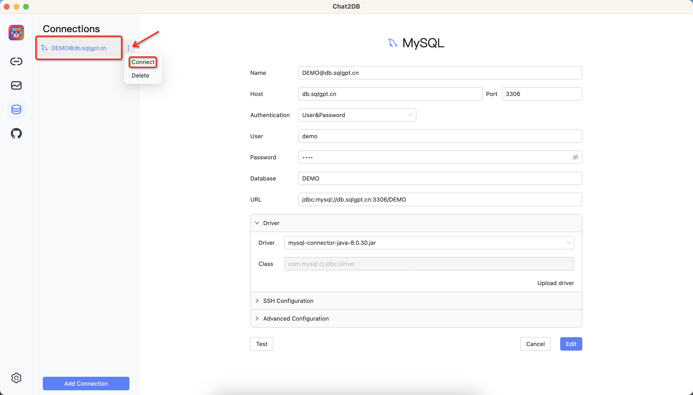
⚠ Tips: Accessing the DEMO data requires an internet connection. If you cannot connect to the internet, ignore the error and delete the DEMO data. Then connect to your own database.

As shown in the image below, Chat2DB has connected to the DEMO database and can be used directly. The block 2 and 3 represent database schemas, you can click there to switch databases. The block 4 and 5 show the database tables, you can click here to view table structures. The block 6 can add a new console where you can execute sql on your database.

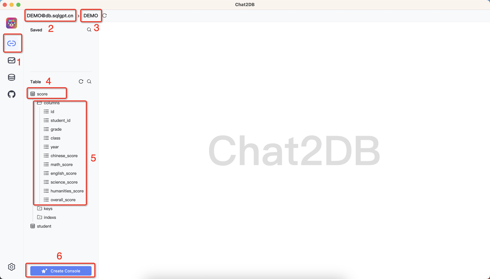

Click the dashboard button on the left to view the dashboard features

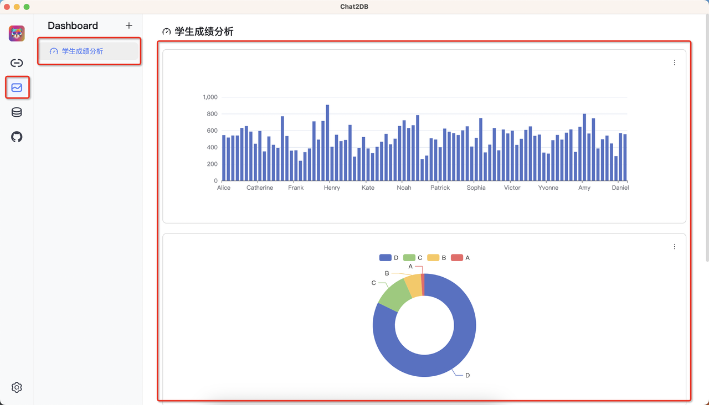

## DataSource Management

Click the "Connection" button on the left and select your database type when you add new connection.

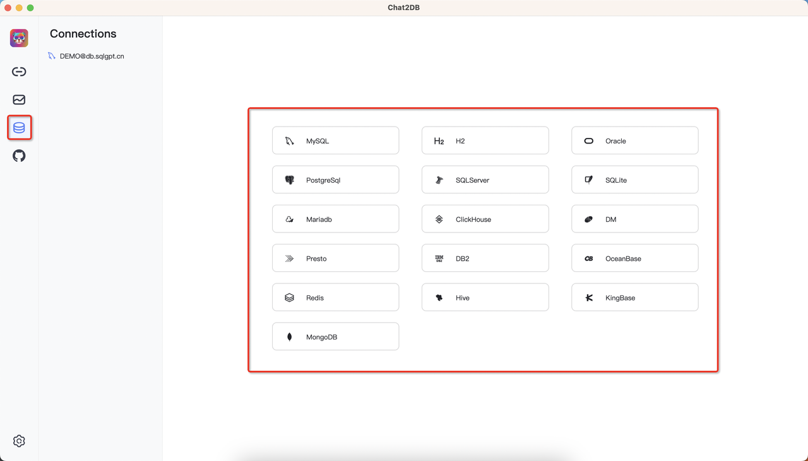

### Configure Database Connection

Configure the database connection, click the "Test" button. If the connection is successful, click the "Save" button to save the connection. Then double click the connection to connect to your database.

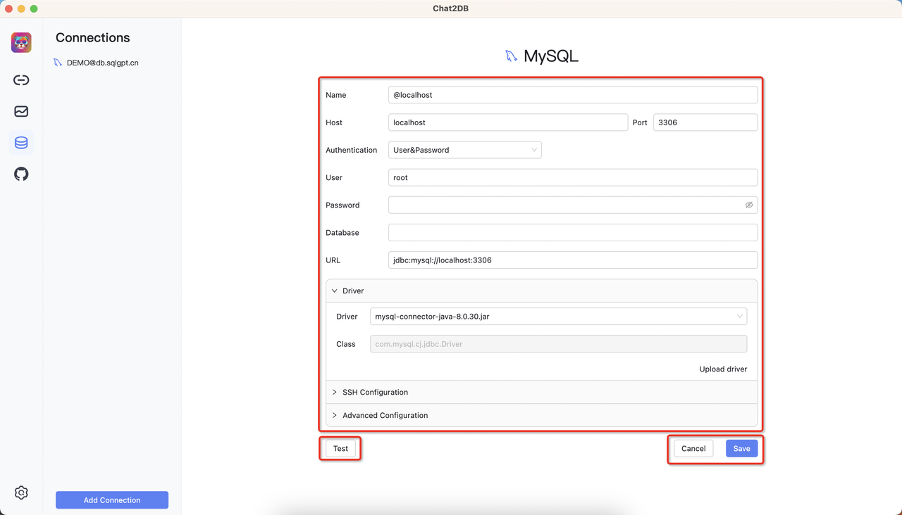

### Configure Database Driver

Connecting to a database requires downloading the corresponding driver. If the driver is empty, there are two ways to configure the driver:

1. If you can connect to the internet, click the "Download Driver" button to download the driver, then choose the driver.
2. If you cannot connect to the internet or the default driver does not match your database, you can download the driver manually. Click the "Upload Driver" button, select the driver file to upload. You can use your local driver after uploading.

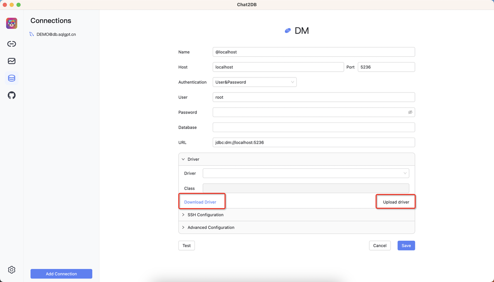
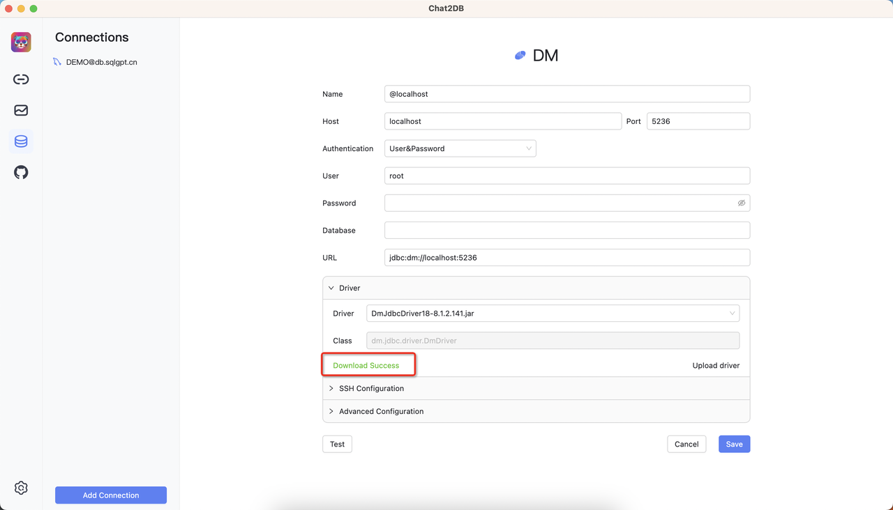
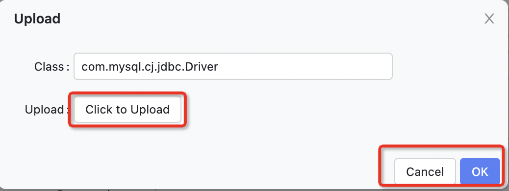

### Configure SSH Tunnel

If the database needs to be connected via an SSH tunnel, set "Use SSH" as true to configure SSH tunnel. Then click the "Test the SSH Tunnel" button, you can connect to your database via ssh after the test is successful.

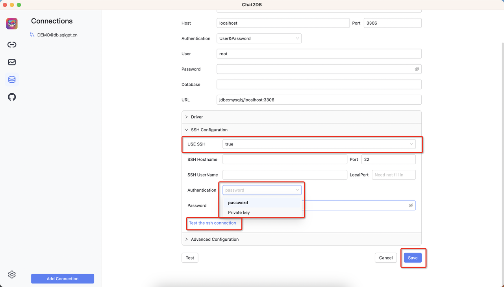

### ⚠ Error Prompts

If the connection fails, there will be error prompts. You can troubleshoot based on the error prompts. 99%+ of issues are configuration errors or driver version mismatches with your database version. Most can be resolved by searching online.

If you still cannot resolve the issue, copy the error details and submit an issue on GitHub. We will check all the issues regularly, so submitting an issue is the most effective way to resolve problems.

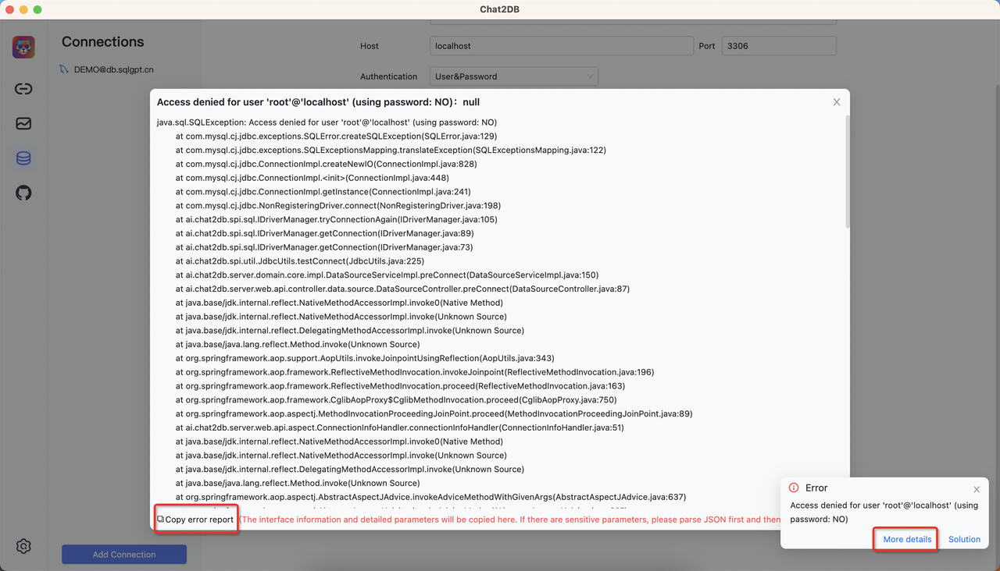

## Database Management

Click the first button on the left to view the connected databases. The block 2 and 3 represent database schemas, you can click here to switch databases. The block 4 and 5 represent database tables, click table to view table structures. Click button in block 6 can create a new SQL console where you can perform operations on the database.


Select the SQL in the console, then you can click the "Run" button to execute the SQL. The bottom of console will display the execution results, you can page through the results or export them. Also, you can click the Format button to format the selected SQL.
Meanwhile, you can click the "Save" button in the console to save the SQL. Then you can view saved records in the block "Saved" and directly open them next time.

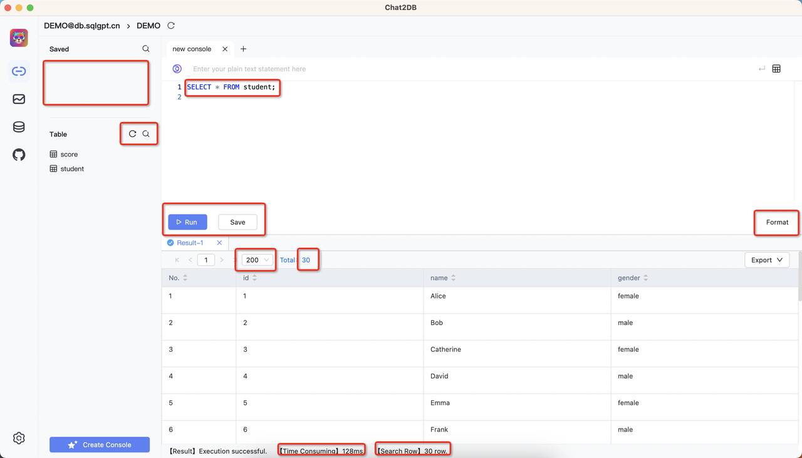

## AI Management

### Option1 : ⚠ Use AI through OpenAI key

⚠ Tips: Using the OpenAI key makes direct requests to the OpenAI API. Chat2DB does not limit the use of OpenAI, if you have any objections you can review the code directly.
If you encounter errors using OpenAI, 95% are due to OpenAI restrictions:

Accessing OpenAI requires being able to bypass the firewall and enable global proxies. Many proxy tools do not support global proxies which lead AI to not work. Please troubleshoot your proxy by yourself.
Most people buy a shared key on Taobao or other platforms to access OpenAI which were restricted - if multiple people use the same key, OpenAI will limit its usage.
Please refer the OpenAI official document here: https://platform.openai.com/docs/guides/rate-limits/overview

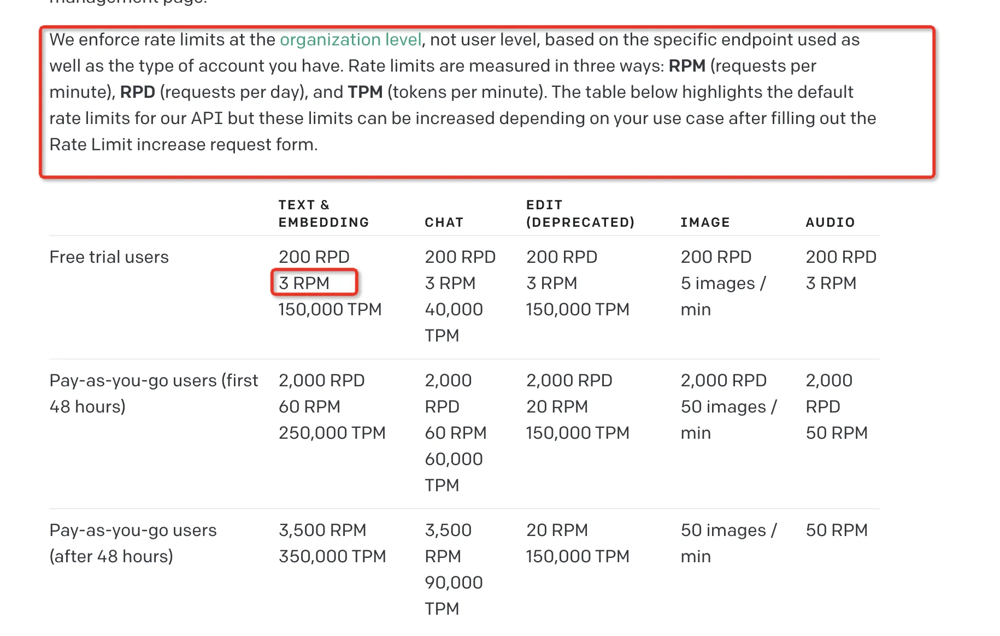

If you have resolved the above issues, you can follow the below steps to configure and use OpenAI.

Click Settings in the lower left corner --> Custom AI --> OpenAI, enter the OpenAI key and click Save. The API Host usually does not need to be configured. If you have a private OpenAI proxy, you can modify the API Host. HTTP Proxy Host and HTTP Proxy Port are usually not needed, configure them if your network needs a proxy to access OpenAI.

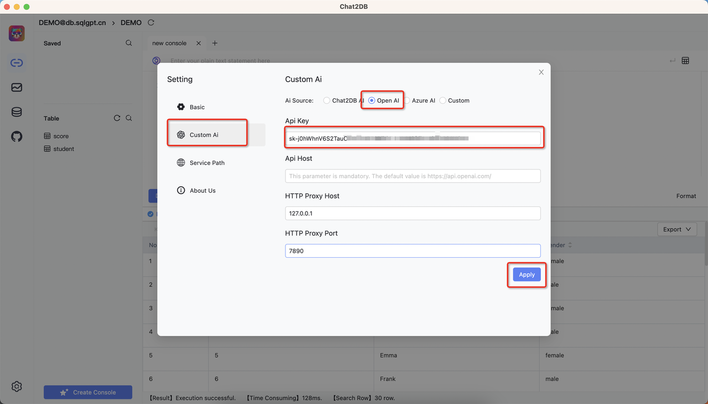

### Option2: ✅ Use AI through Chat2DB AI (recommended)

Chat2DB AI does not require bypassing the firewall. Scan the QR code below to follow the Chat2DB Official Account, reply "AI" to get an AI key, then configure it in Chat2DB to use AI capabilities.


Click Settings in the lower left corner --> Custom AI --> Chat2DB AI, enter the AI key and click Save.

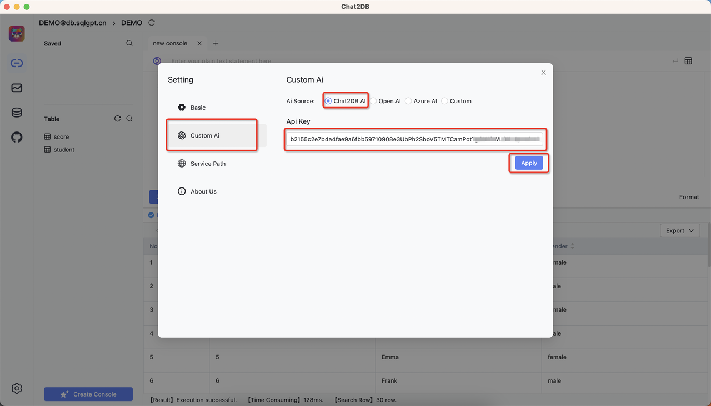

### Other options:

We also support AzureAI or custom AI. The configuration is similar, just modify the AI type and key.

## Using AI

### 1、AI generates SQL

In Database Management -> select the database -> create a new SQL console. There is an input box above the console, enter the natural language that you want AI to generate, then press Enter button. AI will automatically generate the SQL you wanted in the console. Click the Execute button to execute it. The results will display on the bottom of the console, you can page through them or export them.

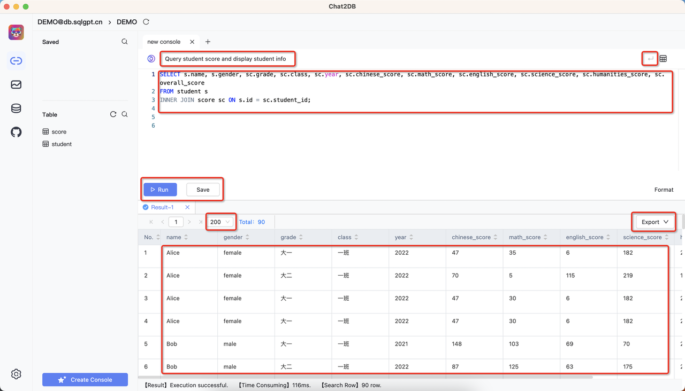

### 2、Explain SQL

Right-click the selected SQL -> click Explain SQL. AI will explain the SQL in the popup window on the right of the console.

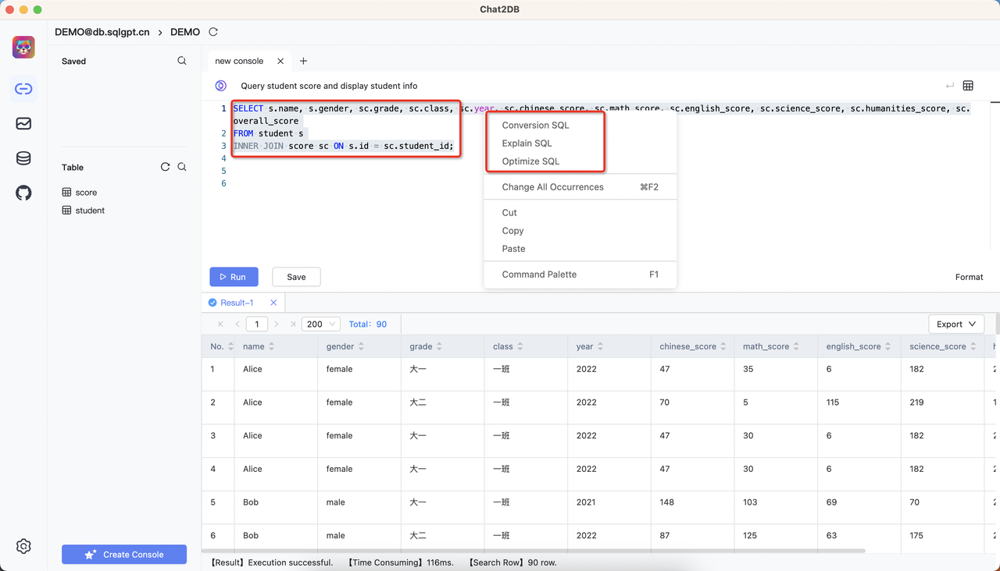

### 3、Optimize SQL

Right-click the selected SQL -> click Optimize SQL. AI will generate suggestions in the popup window.

### 4、Convert SQL

Right-click the selected SQL -> click Convert SQL. AI will convert the current SQL syntax to another database syntax in the popup window.

## BI Reports Dashboard

Click the second button on the left to view created reports. Click the report and view the corresponding data.

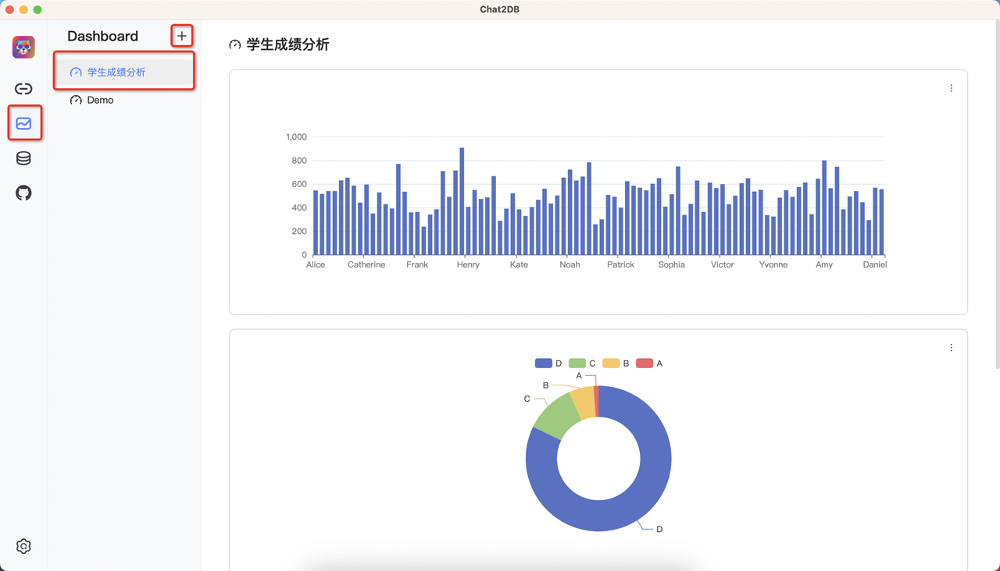

Click the "+" button to create a new dashboard -> enter the dashboard name -> click Save. Then select the newly created dashboard to start editing data.

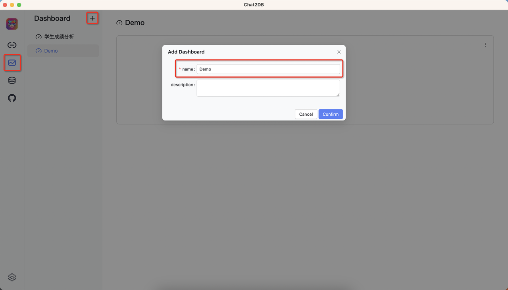

- 1、Select the data source for the current chart which you can choose from the connected databases.
- 2、Enter the data to query for this report chart, AI will start generating the SQL.
- 3、Click the "Run" button to return the data format.
- 4、Select the chart type, x axis and y axis.
- 5、Click "Confirm" button to save the current chart.
- 6、Click the "+" under the chart to continue adding chart to the current report dashboard.
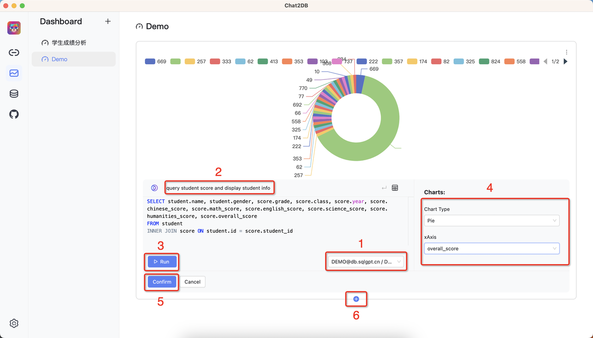

## Local Debugging

- git clone to your local repository

```bash
$ git clone git@github.com:chat2db/Chat2DB.git
```

- Frontend debugging

```bash
Node version must be 16+
Execute below command to install nodejs
$ cd Chat2DB/chat2db-client
$ yarn
$ yarn run start:web
```

- Backend debugging

```bash
$ cd ../chat2db-server
$ mvn clean install # Requires maven 3.8+
$ cd chat2db-server/chat2db-server-start/target/
$ java -jar -Dloader.path=/lib -Dchatgpt.apiKey=xxxxx chat2db-server-start.jar  # 启动应用 chatgpt.apiKey 需要输入ChatGPT的key,如果不输入无法使用AIGC功能
```
