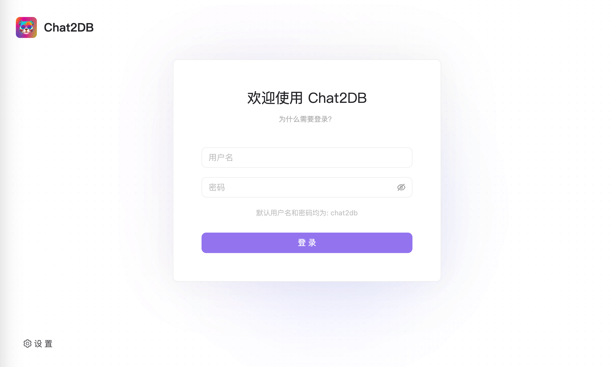
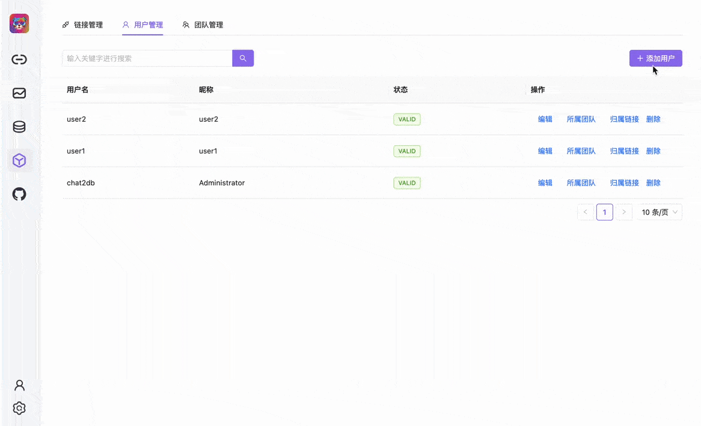
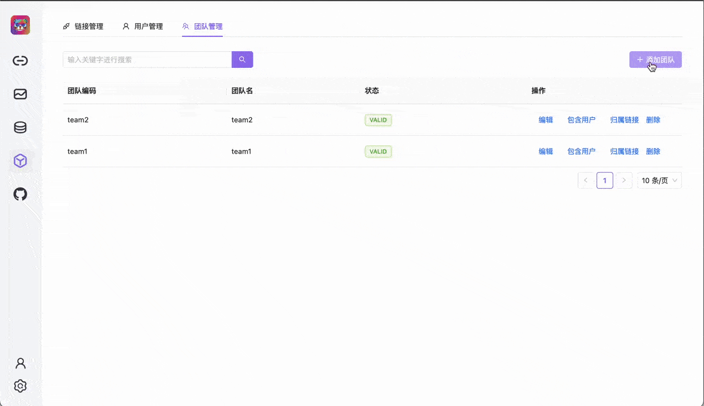
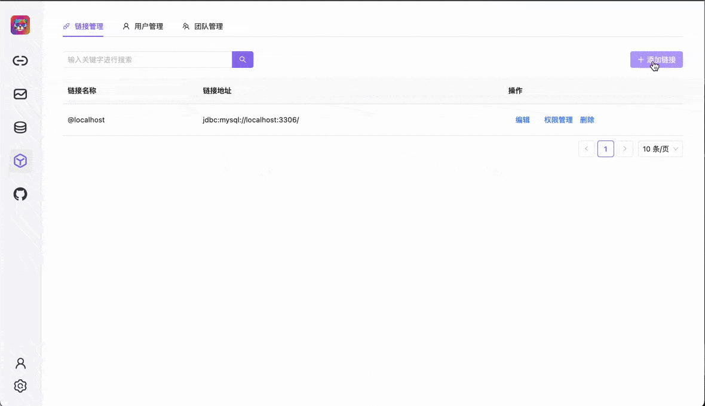
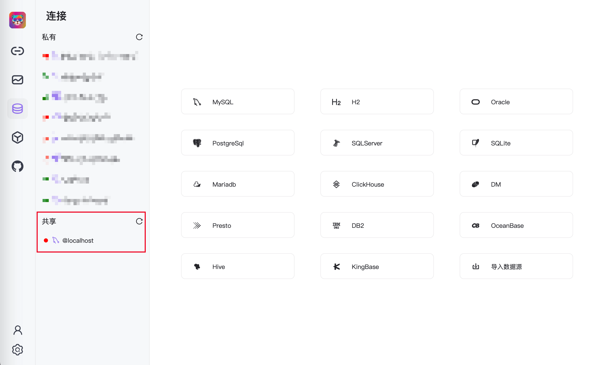

# Team Collaboration

> Team Collaboration：One-stop management of users, teams, and link sources.

## One-stop management of users, teams, and link sources.

This feature will be provided in a standalone deployment (Web version).

## Login Module

** The default username and password are both `chat2db`. **

## User Management

Features included:

- Add, edit, and delete users.
- Add users to teams.
- Add link sources for users.

## Team Management

Features included:

- Add, edit, and delete teams.
- Add users to teams.
- Add link sources for teams.

## Link Source Management
Link Source Management

- Add, edit, and delete link sources.
- Add teams and users to link sources.
  

## Link Source Interface

The link source interface will differentiate between personal link sources and team link sources.

