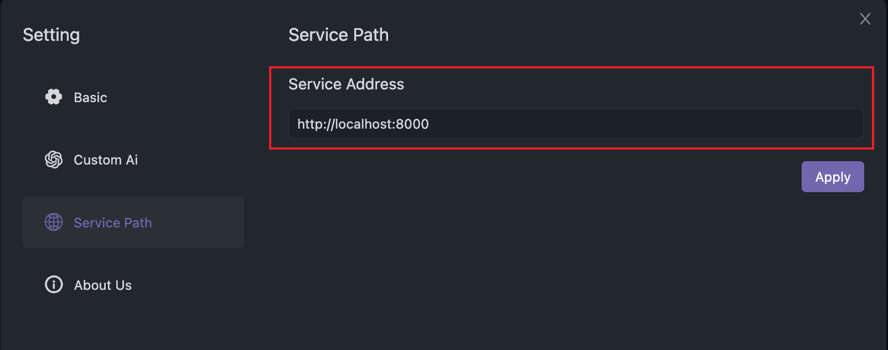

- 在实际调研中我们会发现一部分同学喜欢客户端软件体验好，一部分同学喜欢web版用完就走，不需要装一堆软件。所以我们在设计之初就考虑既要支持客户端，也要支持网页版。最终我们支持了Mac、Linux、Windows客户端、web版。

**先看看Navicat、DBever、DataGrip的技术方案分别是什么样的，以及他们的优缺点？**

| 方案 | 优势 | 劣势 |
| --- | --- | --- |
| **Navicat（C++）** | 流程性好，功能丰富 | 不支持网页版，开发成本大 |
| **DBever（Java swing + JS）** | 可以跨多个操作系统、也支持网页版 | 网页版单独开发成本大 |
| **DataGrip（Java swing）** | 体验好、视觉好 | 不支持网页版 |

有没有一种**完美方案**既可以支持网页版，又支持跨端，又通用的前端完美方案，答案就是electron，最成功的案例就是VSCode体验好，还可以多个端部署，部署网页版也非常简单。
那服务端怎么做呢？
**为了做到支持多端我们做了一些技术选型的比较**

| 方案 | 优势 | 劣势 |
| --- | --- | --- |
| **Electron + Nodejs** | 纯JS前端就可以开发，体验也不错 | js在各种不同数据库支持上不够完美，前端往往不做数据库开发，去了解各个数据库特性很难 |
| **Java swing + js** | 支持多端，java又能很好的处理各种数据库。js支持网页版 | swing太难用,java同学使用也不多。前端开发2套 |
| **Electron+js + Java** | 支持多端展示，也支持web。前后端分离 | 服务端启动慢 |

最终我们选择了**Electron+js+Java 的方案，应该是第一个是用该方案的人来支持客户端也支持网页版**。
这个方案很好的解决了复用，效率，语言优势等多个特性。唯一缺点就是java启动spring慢了一点。但我们做了很多优化基本5s秒钟可以启动起来，跟大部分软件差不多。未来我们减少spring依赖应该性能还可以接受。另外我们未来也可以提供给用户选择关闭客户端时候java进程不关闭的方式，下次启动就可以秒启动，所以这么劣势对我们影响不大。

|   平台     | Mac     | Windows | Linux   | Web     |
| --------- | ------- | ------- | ------- | ------- |
| 支持情况  | ✅ 支持  | ✅ 支持  | ✅ 支持  | ✅ 支持  |

## 客户端连接公用服务
默认连接的是自己本地，如果团队有公用服务可以配置公用服务的ip和端口

