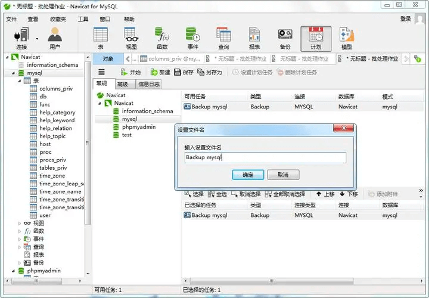
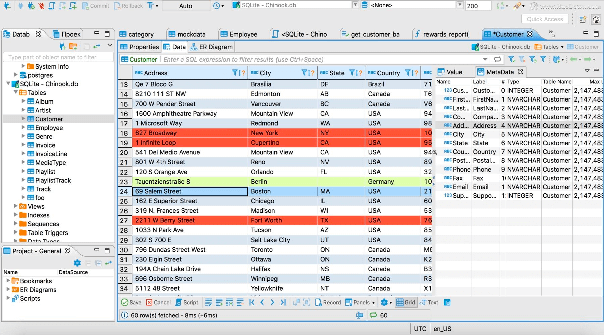
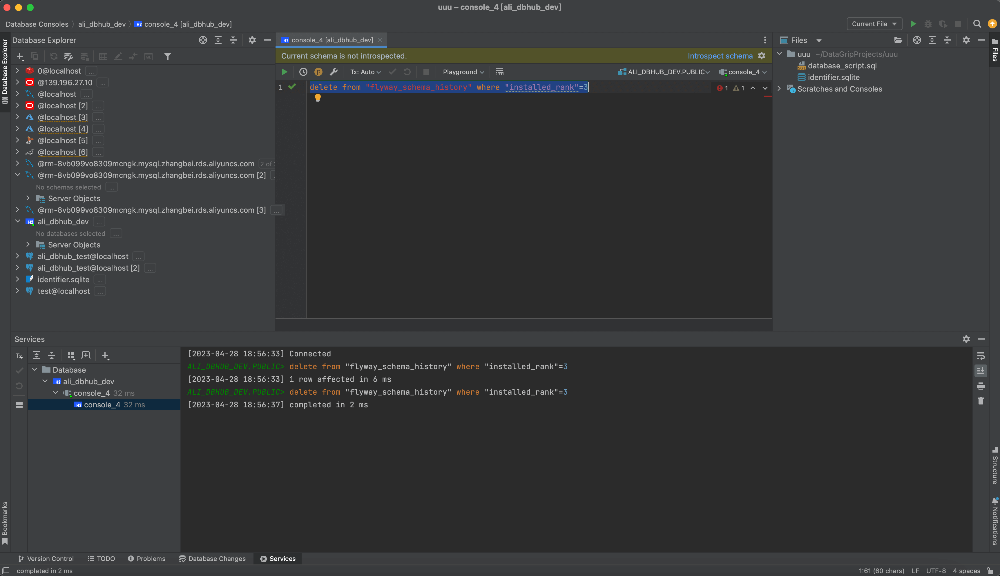
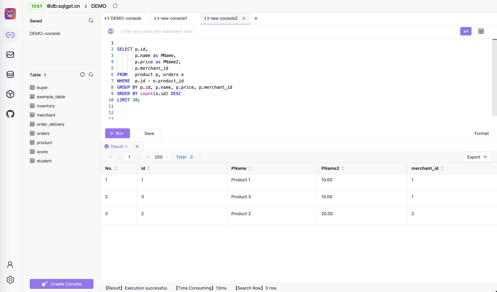
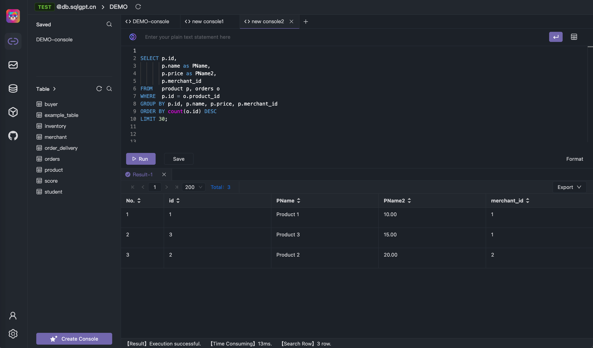

整体视觉体验参考了Navicat、DBever、DataGrip，我们遵循的原则足够简洁易用，简洁的视觉效果能够提升技术人的工作效率。综合比较了这几款软件最终还是觉得DataGrip体验最好，在设计更多的借鉴了DataGrip的一些设计。
## Navicat

## DBever

## DataGrip

## Chat2DB
通过这几个常用数据库软件的比较明显DataGrip视觉效果更好，所以视觉设计和体验上我们学习DataGrip.
我们是不是和DataGrip有点像，我们也支持暗黑模式。除了背景色未来我们也会把主题色开放出来让大家自己选择。

