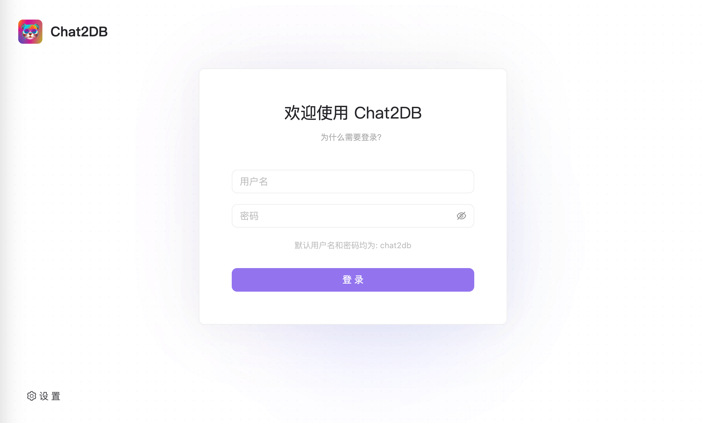
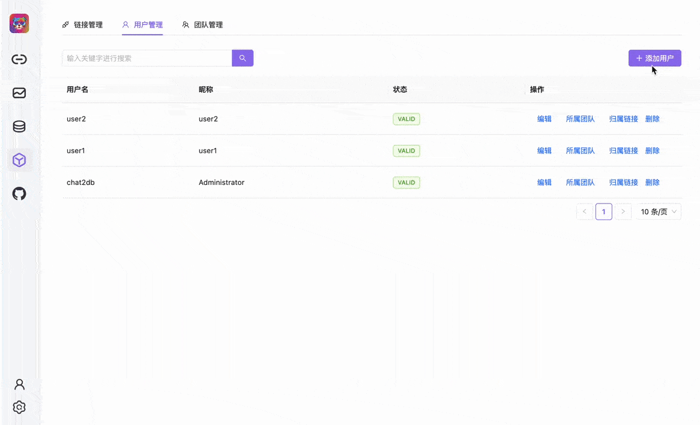
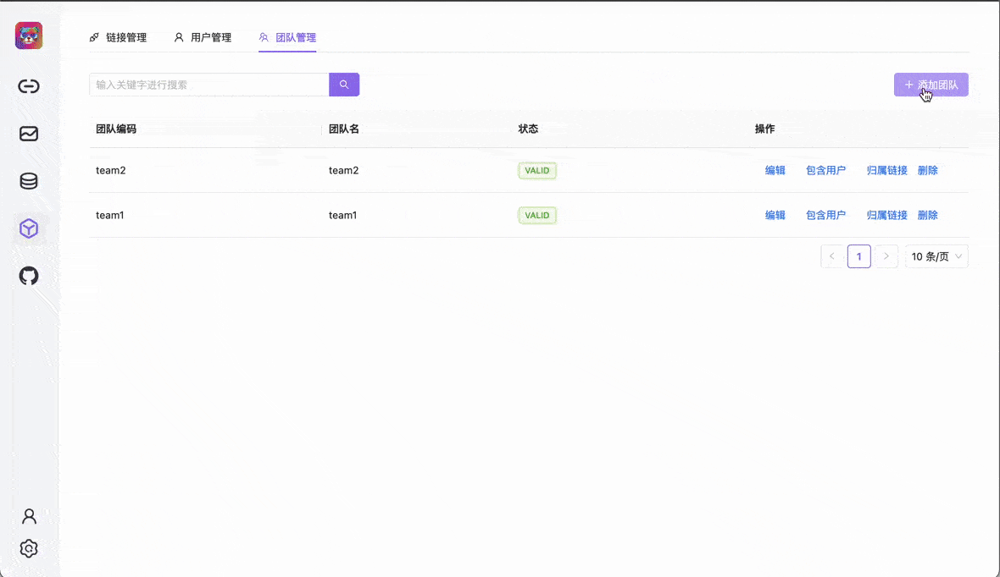
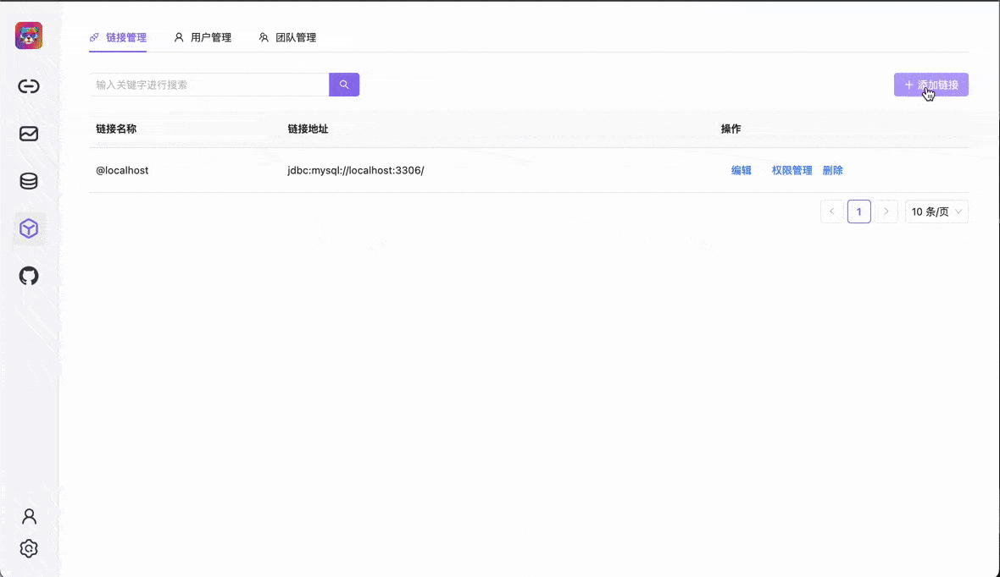
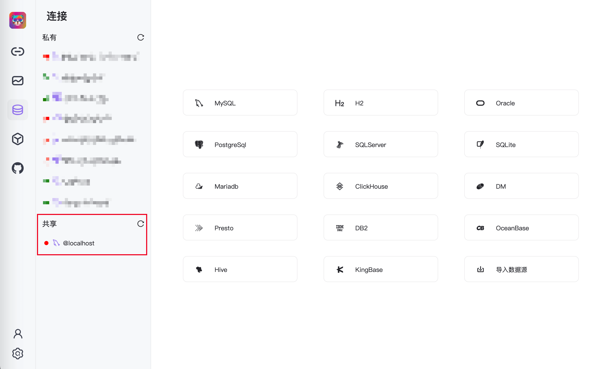

# 团队协作

> 团队协作：一站式管理用户、团队和链接源

## 写在前面

此功能将在独立部署（ Web端 ）提供。

## 登录模块

** 默认用户名和密码都为`chat2db` **

## 用户管理
包含功能
- 对用户的新增、编辑、删除
- 将用户添加到团队中
- 为用户添加链接源

## 团队管理
包含功能
- 对团队的新增、编辑、删除
- 为团队添加用户
- 为团队添加链接源

## 链接源管理
包含功能
- 对链接源的新增、编辑、删除
- 为链接源添加团队和用户

## 链接源界面

链接源界面会区分个人链接源和团队链接源

